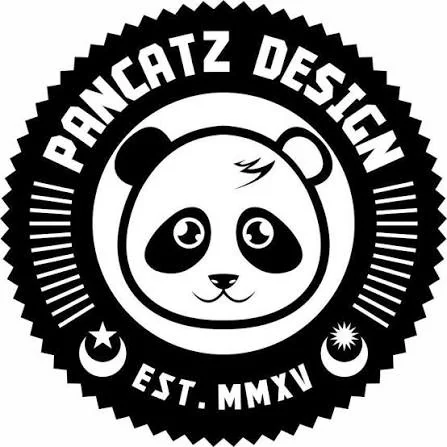

<div align="center">
  

  # Pancatz

  **A single-page creative-tech studio site for businesses that want to look sharper and run smoother.**

  [](https://astro.build/)
  [](https://nodejs.org/)
  [](https://www.docker.com/)

  [Live site](https://pancatz.com) · [Development](#development) · [Deployment](#deployment)
</div>

---

## What this build is

Pancatz is an Astro static site for a Johor Bahru–based studio that combines three connected disciplines:

- **Creative:** brand identity, social assets, menus, signage, and print production
- **IT support:** PC/laptop repair, Wi-Fi and network infrastructure, ongoing tech care
- **AI & automation:** chatbots, n8n workflows, image-generation pipelines, lead routing

It is deliberately a **single long-form page**. Navigation, pricing, work, service selection, and the enquiry path are section anchors on `/`; there are no separate service, portfolio, pricing, or contact routes in the current build.

## Current experience

| Area | Implementation |
|---|---|
| Hero | Outcome-led positioning: businesses that “look sharper and run smoother,” with layered geometric parallax and primary/secondary conversion actions. |
| Capabilities | A responsive asymmetric bento system explaining Creative, IT Support, and AI & Automation as one integrated offer. |
| Selected work | Two clearly labelled editorial case-study placeholders — **not fake proof** — awaiting real project imagery. |
| Services | Detailed service lanes with links that preselect the relevant enquiry category. |
| Pricing | Client-side selector covering Creative, Print, IT Support, AI & Automation, and retainers; prices are indicative and in MYR. |
| Enquiry | Name, contact, service, and project brief form posted to an n8n webhook; a hidden honeypot rejects simple bot submissions. |
| Navigation | Fixed glass header, active-section state, responsive mobile drawer, and smooth anchor scrolling. |
| Motion | GSAP ScrollTrigger parallax, scrubbed reveals, subtle project/card interaction, and a complete `prefers-reduced-motion` fallback. |
| Accessibility | Visible focus states, semantic landmarks, labelled form controls, 44–48px touch targets, and motion reduction support. |

### Contact flow

The form posts JSON to:

```text
https://n8n.pancatz.com/webhook/pancatz-contact
```

The n8n workflow is responsible for receiving and routing the enquiry. The frontend shows a success state on a successful HTTP response and falls back to the configured email address if it fails.

## Visual direction

The design is intentionally dark, editorial, and creative-tech rather than generic SaaS:

- Near-black canvas: `#0a0a0a`
- Off-white reading color: `#f0ede8`
- Electric lime action color: `#c8ff00`
- Coral secondary signal: `#ff6b4a`
- Geist + Geist Mono typography, glass surfaces, thin grid lines, large editorial type, and asymmetric bento layouts

The current work section reserves exact image ratios for future case studies:

| Asset | Desktop | Mobile | Format target |
|---|---:|---:|---|
| Each case study | 2400 × 1600 (3:2) | 1440 × 1800 (4:5, optional) | WebP or JPEG, ideally under 500 KB |

See the [current design documentation](docs/design/) for the rationale and next-level art-direction requirements.

## Stack

| Layer | Choice |
|---|---|
| Framework | Astro 6 static-site build |
| UI runtime | React 19 integration (available for islands/components) |
| Styling | Tailwind CSS v4 through Vite + authored global CSS/tokens |
| Motion | GSAP + ScrollTrigger |
| Typography | Geist and Geist Mono via Google Fonts |
| Contact delivery | n8n webhook |
| Production serving | Nginx 1.27 Alpine in a multi-stage Docker image |
| CI image publishing | GitHub Actions → GitHub Container Registry (`ghcr.io`) |
| Self-hosting | Docker Compose; Coolify/Traefik compose configuration included |

## Development

### Requirements

- Node.js `>=22.12.0`
- npm

### Run locally

```bash
git clone https://github.com/syafiqabdha/pancatz-site.git
cd pancatz-site
npm ci
npm run dev
```

Astro serves the development site at `http://localhost:4321` by default.

### Available commands

| Command | Purpose |
|---|---|
| `npm run dev` | Start Astro’s development server. |
| `npm run build` | Produce an optimized static site in `dist/`. |
| `npm run preview` | Serve the latest production build locally. |
| `npm run astro -- …` | Run Astro CLI commands. |
| `npm run astryx -- …` | Run the installed Astryx CLI. |

### Production check

```bash
npm run build
npm run preview
```

The build must pass before deployment. Review the site at desktop and mobile widths, test all anchor paths, pricing tabs, mobile navigation, and an enquiry submission against the intended n8n environment.

## Deployment

### Docker / Nginx

The primary `Dockerfile` builds the static Astro output with Node 22 Alpine, then serves `dist/` with Nginx 1.27 Alpine. Nginx adds baseline security headers, gzip, clean static URL resolution, and long-lived caching for Astro assets.

```bash
docker build -t pancatz-site:local .
docker run --rm -p 8088:80 pancatz-site:local
```

Open `http://localhost:8088`.

### Docker Compose

```bash
docker compose up -d --build
```

The default host port is `8088`; override it with `PORT`:

```bash
PORT=8090 docker compose up -d --build
```

### Coolify / Traefik

[`docker-compose.coolify.yml`](docker-compose.coolify.yml) attaches the container to the external `coolify` network and configures routes for `pancatz.com` and `www.pancatz.com` over TLS.

### GitHub Container Registry

The GitHub Actions workflow builds on pull requests and builds/publishes the image for pushes to `master` and version tags. Published images use the GitHub repository name under:

```text
ghcr.io/syafiqabdha/pancatz-site
```

## Repository map

```text
pancatz-site/
├── src/
│   ├── pages/index.astro       # The complete single-page experience and client interactions
│   ├── layouts/Layout.astro    # Document shell, fixed navigation, footer, mobile drawer
│   ├── data/site.ts            # Brand/contact configuration and enquiry intent labels
│   └── styles/
│       ├── global.css          # Design tokens, responsive layouts, motion and accessibility rules
│       └── theme/              # Existing Astryx theme artifacts
├── public/                     # Logo, OG image, favicon, and legacy/project image assets
├── .github/workflows/          # Container build/publish workflow
├── Dockerfile                  # Multi-stage Astro build + Nginx image
├── Dockerfile.cloudrun         # Alternative static-server image for Cloud Run
├── docker-compose.yml          # Local self-hosted compose setup
├── docker-compose.coolify.yml  # Coolify/Traefik setup for pancatz.com
├── nginx.conf                  # Static serving, caching, gzip, security headers
├── docs/                       # Current design docs + archived planning context
└── package.json                # Scripts, engines, and dependencies
```

## Content and design guardrails

- Do not invent client outcomes, testimonials, logos, or case studies.
- Keep the site’s unified promise intact: Creative, IT, and AI are supporting disciplines, not competing homepages.
- Replace the two work placeholders only with approved, real project material.
- Content must remain visible without JavaScript; animation can enhance it, never gate it.
- Preserve reduced-motion behavior and at least 44px interactive touch targets.
- Treat the form webhook as production infrastructure: coordinate changes with its n8n workflow.
- Review [`CONTRIBUTING.md`](CONTRIBUTING.md) before introducing Astryx components or changing its theme artifacts. Its Astryx guidance is legacy-oriented; the live page currently relies chiefly on Astro, Tailwind utilities, and `src/styles/global.css`.

## Brand/contact configuration

The editable site configuration is centralized in [`src/data/site.ts`](src/data/site.ts):

- `pancatz.design@gmail.com`
- [Instagram @pancatz.design](https://www.instagram.com/pancatz.design)
- [Facebook /pancatz](https://www.facebook.com/pancatz)
- Contact webhook URL and enquiry-category labels

---

© Pancatz. All rights reserved.
